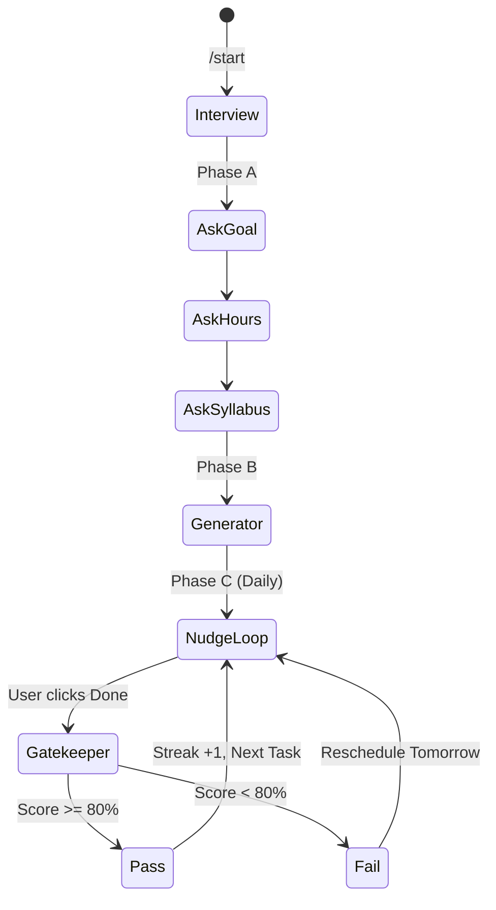

# Axiom - Full Project Architecture & Structure

An AI-driven growth partner using a **Hub-and-Spoke** model: FastAPI at the center, Telegram as the interface, Gemini Flash as the brain.

## Tech Stack

| Layer | Technology | Role |
|---|---|---|
| **API** | FastAPI | Central brain, routes, LLM orchestration |
| **Database** | PostgreSQL + pgvector | Users, roadmaps, tasks, syllabus embeddings |
| **Interface** | aiogram 3.x (Telegram Bot) | All user interaction, MCQ inline keyboards |
| **Scheduler** | APScheduler | Daily nudges based on user timezone |
| **LLM** | Gemini Flash (Google AI Studio) | Roadmap generation, MCQ generation |
| **Validation** | Pydantic v2 | Enforce JSON structure from LLM responses |

---

## Database Schema

| Table | Key Fields | Purpose |
|---|---|---|
| `users` | `telegram_id`, `timezone`, `streak_count`, `current_goal` | Identity & motivation |
| `roadmaps` | `user_id`, `raw_syllabus`, `json_plan`, `start_date` | AI-generated master schedule |
| `tasks` | `roadmap_id`, `title`, `status` (Pending/Verified), `due_date` | Individual learning nodes |
| `verifications` | `task_id`, `mcq_json`, `score`, `attempts` | Gatekeeper test records |

---

## Proposed Project Structure

```
d:/Projects/Axiom/
├── .env.example              # Environment variable template
├── .gitignore
├── README.md
├── requirements.txt
├── docker-compose.yml        # PostgreSQL + pgvector
├── alembic.ini               # DB migration config
├── alembic/                  # Migration scripts
│   ├── env.py
│   └── versions/
│
├── app/
│   ├── __init__.py
│   ├── main.py               # FastAPI entry point
│   ├── config.py             # Settings via pydantic-settings
│   │
│   ├── db/
│   │   ├── __init__.py
│   │   ├── session.py        # AsyncSession factory
│   │   └── base.py           # SQLAlchemy Base
│   │
│   ├── models/               # SQLAlchemy ORM models
│   │   ├── __init__.py
│   │   ├── user.py
│   │   ├── roadmap.py
│   │   ├── task.py
│   │   └── verification.py
│   │
│   ├── schemas/              # Pydantic request/response schemas
│   │   ├── __init__.py
│   │   ├── user.py
│   │   ├── roadmap.py
│   │   ├── task.py
│   │   └── verification.py
│   │
│   ├── routers/              # FastAPI route handlers
│   │   ├── __init__.py
│   │   ├── users.py
│   │   ├── roadmaps.py
│   │   ├── tasks.py
│   │   └── webhooks.py       # Telegram webhook endpoint
│   │
│   ├── services/             # Business logic layer
│   │   ├── __init__.py
│   │   ├── onboarding.py     # Interrogation state machine
│   │   ├── roadmap_gen.py    # LLM → JSON roadmap pipeline
│   │   ├── mcq_gen.py        # LLM → MCQ generation
│   │   ├── gatekeeper.py     # Score verification & streak logic
│   │   └── scheduler.py      # APScheduler nudge manager
│   │
│   ├── llm/                  # LLM integration layer
│   │   ├── __init__.py
│   │   ├── client.py         # Gemini Flash API client
│   │   ├── prompts.py        # All prompt templates
│   │   └── parsers.py        # Pydantic validators for LLM output
│   │
│   └── utils/
│       ├── __init__.py
│       └── helpers.py
│
├── bot/                      # Telegram Bot (aiogram 3.x)
│   ├── __init__.py
│   ├── main.py               # Bot entry point & dispatcher
│   ├── middlewares/
│   │   ├── __init__.py
│   │   └── auth.py           # User registration middleware
│   ├── handlers/
│   │   ├── __init__.py
│   │   ├── start.py          # /start command
│   │   ├── onboarding.py     # Interview state machine (FSM)
│   │   ├── daily_task.py     # Nudge interaction handlers
│   │   └── quiz.py           # MCQ inline keyboard handlers
│   ├── keyboards/
│   │   ├── __init__.py
│   │   ├── inline.py         # InlineKeyboard builders for MCQs
│   │   └── reply.py          # ReplyKeyboard builders
│   ├── states/
│   │   ├── __init__.py
│   │   └── onboarding.py     # FSM states for the interview
│   └── filters/
│       └── __init__.py
│
└── tests/
    ├── __init__.py
    ├── conftest.py            # Fixtures (test DB, mock LLM)
    ├── test_routers/
    │   └── test_users.py
    ├── test_services/
    │   ├── test_roadmap_gen.py
    │   └── test_gatekeeper.py
    └── test_bot/
        └── test_onboarding.py
```

---

## The "Interrogation" Workflow (State Machine)



---

## Build Sequence
# Axiom - Full Project Architecture & Structure

An AI-driven growth partner using a **Hub-and-Spoke** model: FastAPI at the center, Telegram as the interface, Gemini Flash as the brain.

## Tech Stack

| Layer | Technology | Role |
|---|---|---|
| **API** | FastAPI | Central brain, routes, LLM orchestration |
| **Database** | PostgreSQL + pgvector | Users, roadmaps, tasks, syllabus embeddings |
| **Interface** | aiogram 3.x (Telegram Bot) | All user interaction, MCQ inline keyboards |
| **Scheduler** | APScheduler | Daily nudges based on user timezone |
| **LLM** | Gemini Flash (Google AI Studio) | Roadmap generation, MCQ generation |
| **Validation** | Pydantic v2 | Enforce JSON structure from LLM responses |

---

## Database Schema

| Table | Key Fields | Purpose |
|---|---|---|
| `users` | `telegram_id`, `timezone`, `streak_count`, `current_goal` | Identity & motivation |
| `roadmaps` | `user_id`, `raw_syllabus`, `json_plan`, `start_date` | AI-generated master schedule |
| `tasks` | `roadmap_id`, `title`, `status` (Pending/Verified), `due_date` | Individual learning nodes |
| `verifications` | `task_id`, `mcq_json`, `score`, `attempts` | Gatekeeper test records |

---

## Proposed Project Structure

```
d:/Projects/Axiom/
├── .env.example              # Environment variable template
├── .gitignore
├── README.md
├── requirements.txt
├── docker-compose.yml        # PostgreSQL + pgvector
├── alembic.ini               # DB migration config
├── alembic/                  # Migration scripts
│   ├── env.py
│   └── versions/
│
├── app/
│   ├── __init__.py
│   ├── main.py               # FastAPI entry point
│   ├── config.py             # Settings via pydantic-settings
│   │
│   ├── db/
│   │   ├── __init__.py
│   │   ├── session.py        # AsyncSession factory
│   │   └── base.py           # SQLAlchemy Base
│   │
│   ├── models/               # SQLAlchemy ORM models
│   │   ├── __init__.py
│   │   ├── user.py
│   │   ├── roadmap.py
│   │   ├── task.py
│   │   └── verification.py
│   │
│   ├── schemas/              # Pydantic request/response schemas
│   │   ├── __init__.py
│   │   ├── user.py
│   │   ├── roadmap.py
│   │   ├── task.py
│   │   └── verification.py
│   │
│   ├── routers/              # FastAPI route handlers
│   │   ├── __init__.py
│   │   ├── users.py
│   │   ├── roadmaps.py
│   │   ├── tasks.py
│   │   └── webhooks.py       # Telegram webhook endpoint
│   │
│   ├── services/             # Business logic layer
│   │   ├── __init__.py
│   │   ├── onboarding.py     # Interrogation state machine
│   │   ├── roadmap_gen.py    # LLM → JSON roadmap pipeline
│   │   ├── mcq_gen.py        # LLM → MCQ generation
│   │   ├── gatekeeper.py     # Score verification & streak logic
│   │   └── scheduler.py      # APScheduler nudge manager
│   │
│   ├── llm/                  # LLM integration layer
│   │   ├── __init__.py
│   │   ├── client.py         # Gemini Flash API client
│   │   ├── prompts.py        # All prompt templates
│   │   └── parsers.py        # Pydantic validators for LLM output
│   │
│   └── utils/
│       ├── __init__.py
│       └── helpers.py
│
├── bot/                      # Telegram Bot (aiogram 3.x)
│   ├── __init__.py
│   ├── main.py               # Bot entry point & dispatcher
│   ├── middlewares/
│   │   ├── __init__.py
│   │   └── auth.py           # User registration middleware
│   ├── handlers/
│   │   ├── __init__.py
│   │   ├── start.py          # /start command
│   │   ├── onboarding.py     # Interview state machine (FSM)
│   │   ├── daily_task.py     # Nudge interaction handlers
│   │   └── quiz.py           # MCQ inline keyboard handlers
│   ├── keyboards/
│   │   ├── __init__.py
│   │   ├── inline.py         # InlineKeyboard builders for MCQs
│   │   └── reply.py          # ReplyKeyboard builders
│   ├── states/
│   │   ├── __init__.py
│   │   └── onboarding.py     # FSM states for the interview
│   └── filters/
│       └── __init__.py
│
└── tests/
    ├── __init__.py
    ├── conftest.py            # Fixtures (test DB, mock LLM)
    ├── test_routers/
    │   └── test_users.py
    ├── test_services/
    │   ├── test_roadmap_gen.py
    │   └── test_gatekeeper.py
    └── test_bot/
        └── test_onboarding.py
```

---

## The "Interrogation" Workflow (State Machine)


---

## Build Sequence

| Week | Milestone |
|---|---|
| **1** | FastAPI + Telegram webhook echo bot + Docker Postgres |
| **2** | Interrogator: Bot asks 4 questions, saves to DB |
| **3** | LLM integration: Generate 7-day plan from user data |
| **4** | Nudge & Quiz loop: APScheduler + MCQ gatekeeper |

---

## Verification Plan

### Automated Tests
- `pytest` for all service-layer logic (roadmap gen, gatekeeper scoring)
- Mock LLM responses via `pytest-mock` to test Pydantic validation of AI output

### Manual Verification
- Test Telegram bot interactions end-to-end via BotFather test bot
- Verify nudge scheduling across timezones
