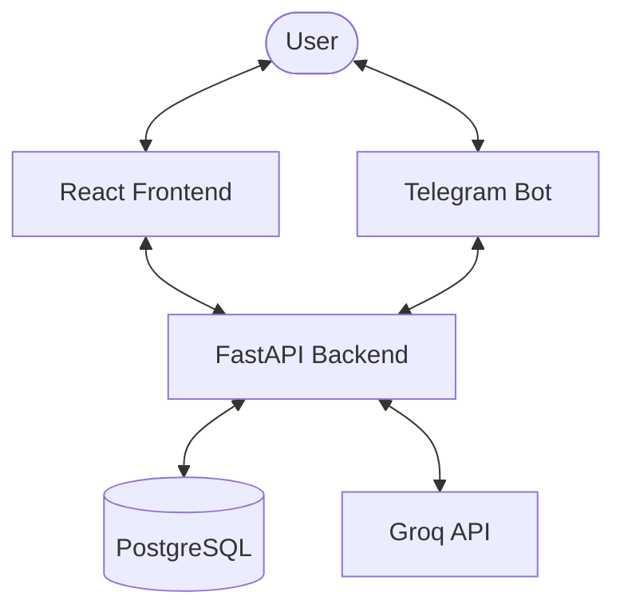

# Edxiom Project Documentation: Structure & Interactions

Edxiom is an AI-driven growth partner that helps users master any subject by generating personalized roadmaps and enforcing learning through mastery quizzes.

---

## 🏗️ High-Level Architecture

The project is a full-stack application consisting of a **FastAPI backend** (Python), a **Telegram bot** (integrated into the backend lifecycle), and a **React 19 frontend** (Vite + Tailwind 4). It uses **PostgreSQL (SQLAlchemy)** for data persistence and **Groq (Llama 3.3)** for AI-driven generation.

---

## 📁 Project Structure

### 1. `backend/`
The core logic of the application, built with FastAPI.

- **[main.py](backend/main.py)**: Entry point. Configures CORS, mounts routers, and manages the Telegram bot lifecycle using an `asyncio` loop.
- **[database.py](backend/database.py)**: Connection and session management for SQLAlchemy.
- **[models.py](backend/models.py)**: Database models (User, Profile, Goal, RoadmapTask, Part, QuizToken, SocialPost).
- **[routers/](backend/routers/)**: API endpoints for authentication, goals, quizzes, and social features.
- **[services/](backend/services/)**: Business logic.
    - [groq.py](backend/services/groq.py): Interface for interacting with the Groq API (Llama 3.3).
    - [synthesis.py](backend/services/synthesis.py): Generates educational content and MCQs with robust JSON cleaning.
    - [youtube.py](backend/services/youtube.py): Integration with YouTube API for fetching relevant video resources.

### 2. `frontend/`
A modern React 19 SPA built with Vite and styled using Tailwind 4.

- **[src/App.jsx](frontend/src/App.jsx)**: Main routing and layout wrapper.
- **[src/pages/Study.jsx](frontend/src/pages/Study.jsx)**: The **Workbench** interface for module-focused learning and quiz management.
- **[src/pages/Social.jsx](frontend/src/pages/Social.jsx)**: Community feed for shared learning blocks.
- **[src/components/](frontend/src/components/)**: Reusable UI units (NeuralLoader, MultimediaEditor, SideNav, etc.).
- **[src/services/api.js](frontend/src/services/api.js)**: Centralized Axios instance for backend communication.

---

## 🔄 Core Interactions

### 🎯 Roadmap Generation Flow
1. **Trigger**: User sets a goal in the Onboarding flow.
2. **Backend**: `create_goal` router triggers the roadmap generation service.
3. **LLM**: Backend sends the objective to Groq to generate a structured syllabus of "Tasks" (Modules) and "Parts" (Segments).
4. **Persistence**: The roadmap is saved to PostgreSQL with a hierarchical relationship (Goal -> Task -> Part).

### 🔒 Neural Seal Mastery (Quizzes)
1. **Trigger**: User clicks "Take Quiz" after completing a module segment.
2. **Backend**: Generates 5 high-quality MCQs using `synthesis.py`.
3. **Stateless Verification**: The backend issues a signed **JWT Quiz Token** containing the correct answers.
4. **Submission**: User submits answers; the backend verifies the token and updates mastery state without persistent quiz logs.

---

## 🎨 Design Philosophy: The Workbench
The Study interface follows a **Workbench** logic:
- **Left Sidebar (Neural Path)**: Constant visibility of the logical hierarchy and roadmap progression.
- **Central Area (Module Focus)**: Deep focus on specific segments, videos, and quizzes.
- **Aesthetic**: "Neo-Cyber" theme with high-blur surfaces, neural animations, and aggressive gold accents (Mastery).

