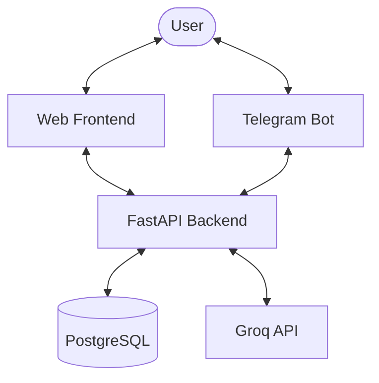

# Axiom Project Documentation: Structure & Interactions

Axiom is an AI-driven growth partner that helps users master any subject by generating personalized roadmaps and enforcing learning through mastery quizzes.

---

## 🏗️ High-Level Architecture

The project is a full-stack application consisting of a **FastAPI backend**, a **Telegram bot**, and a **Vanilla JS web frontend**. It uses **PostgreSQL** for data persistence and **Groq (Llama 3.3)** for AI-driven generation.

---

## 📁 Project Structure

### 1. `app/` (Backend)
The core logic of the application, built with FastAPI.

- **[main.py](file:///d:/Projects/Axiom/bot/main.py)**: Entry point. Configures CORS, mounts routers, and serves the static frontend.
- **[config.py](file:///d:/Projects/Axiom/app/config.py)**: Configuration management using `pydantic-settings`. Loads [.env](file:///d:/Projects/Axiom/.env) variables.
- **`db/`**: Connection and session management for SQLAlchemy.
- **`models/`**: Database models ([User](file:///d:/Projects/Axiom/app/models/user.py#15-39), [Roadmap](file:///d:/Projects/Axiom/app/models/roadmap.py#16-34), [Task](file:///d:/Projects/Axiom/app/models/task.py#23-47), `Verification`).
- **`routers/`**: API endpoints for authentication, roadmaps, tasks, and quizzes.
- **`services/`**: Business logic.
    - [roadmap_gen.py](file:///d:/Projects/Axiom/app/services/roadmap_gen.py): Orchestrates roadmap creation with the LLM.
    - [mcq_gen.py](file:///d:/Projects/Axiom/app/services/mcq_gen.py): Generates quizzes for tasks.
    - [gatekeeper.py](file:///d:/Projects/Axiom/app/services/gatekeeper.py): Evaluates quiz results and updates user progress/streaks.
    - [scheduler.py](file:///d:/Projects/Axiom/app/services/scheduler.py): Handles background tasks (e.g., daily nudges).
- **`llm/`**: LLM-specific logic.
    - [client.py](file:///d:/Projects/Axiom/app/llm/client.py): Client for interacting with the Groq API.
    - [prompts.py](file:///d:/Projects/Axiom/app/llm/prompts.py): System prompts for roadmap and quiz generation.

### 2. `bot/` (Telegram Bot)
The interface for users to interact via Telegram, built with `aiogram`.

- **[main.py](file:///d:/Projects/Axiom/bot/main.py)**: Bot entry point. Configures handlers and start long-polling.
- **`handlers/`**: Message handlers.
    - [start.py](file:///d:/Projects/Axiom/bot/handlers/start.py): Greets the user.
    - [onboarding.py](file:///d:/Projects/Axiom/bot/handlers/onboarding.py): FSM-driven flow to collect user goals and syllabus.
    - [daily_task.py](file:///d:/Projects/Axiom/bot/handlers/daily_task.py): Handles interaction with daily task messages.
    - [quiz.py](file:///d:/Projects/Axiom/app/routers/quiz.py): Handles answering quizzes via inline keyboards.
- **`middlewares/`**: Custom logic like [AuthMiddleware](file:///d:/Projects/Axiom/bot/middlewares/auth.py#18-46) to auto-register users.
- **`states/`**: FSM states for onboarding and other flows.

### 3. `frontend/` (Web App)
A lightweight SPA served directly by the backend.

- **[index.html](file:///d:/Projects/Axiom/frontend/index.html)**: Main HTML structure.
- **[styles.css](file:///d:/Projects/Axiom/frontend/styles.css)**: Modern, responsive styling with a dark theme.
- **[app.js](file:///d:/Projects/Axiom/frontend/app.js)**: Core client-side logic:
    - Hash-based routing.
    - JWT authentication (stored in `localStorage`).
    - API client for interacting with the backend.
    - Page renderers (Dashboard, Roadmap, Quiz, Onboarding).

### 4. `alembic/` (Database Migrations)
Manages the PostgreSQL schema transitions.

- **`versions/`**: Contains migration scripts (Initial schema, User auth updates, etc.).

---

## 🔄 Core Interactions

### 🎯 Roadmap Generation Flow
1. **Trigger**: User provides a goal and syllabus via the Web UI or Telegram Bot.
2. **Backend**: [roadmap_gen.py](file:///d:/Projects/Axiom/app/services/roadmap_gen.py) is called.
3. **LLM**: Backend sends the syllabus to Groq using the `ROADMAP_SYSTEM_PROMPT`.
4. **Processing**: Groq returns a JSON plan. Backend parses it into a [Roadmap](file:///d:/Projects/Axiom/app/models/roadmap.py#16-34) and multiple [Task](file:///d:/Projects/Axiom/app/models/task.py#23-47) objects.
5. **Persistence**: The roadmap and tasks are saved to PostgreSQL.

### 🔒 Mastery Verification Flow
1. **Trigger**: User finishes a daily task and clicks "Mark as Done" or "Take Quiz".
2. **Backend**: [mcq_gen.py](file:///d:/Projects/Axiom/app/services/mcq_gen.py) calls the LLM with the task context to generate 5 MCQs.
3. **User Interaction**: User answers the quiz (either in the Web UI or Bot).
4. **Evaluation**: [gatekeeper.py](file:///d:/Projects/Axiom/app/services/gatekeeper.py) scores the answers.
    - **Pass (≥80%)**: Task status → `verified`, User `streak_count` +1.
    - **Fail (<80%)**: Task status → `rescheduled`, Streak remains same.

### 🔐 Authentication
- **Web**: Uses email/password with JWT (JSON Web Tokens).
- **Bot**: Uses the user's Telegram ID for automatic identification via [AuthMiddleware](file:///d:/Projects/Axiom/bot/middlewares/auth.py#18-46).
- **Linking**: Users can be identified by both if registered properly.

---

## ⚠️ Notes & Observations
- **Bot TODOs**: Several bot handlers ([onboarding.py](file:///d:/Projects/Axiom/bot/handlers/onboarding.py), [daily_task.py](file:///d:/Projects/Axiom/bot/handlers/daily_task.py), [quiz.py](file:///d:/Projects/Axiom/app/routers/quiz.py)) have pending integration points for LLM services.
- **Deployment**: Configured for Railway/Docker with [docker-compose.yml](file:///d:/Projects/Axiom/docker-compose.yml).
